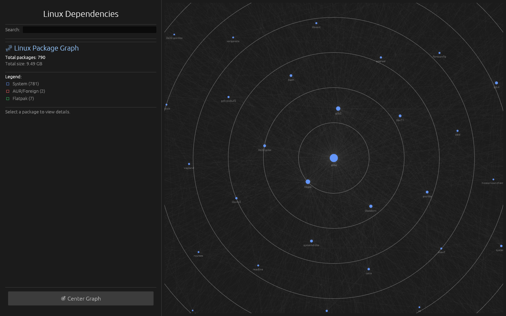
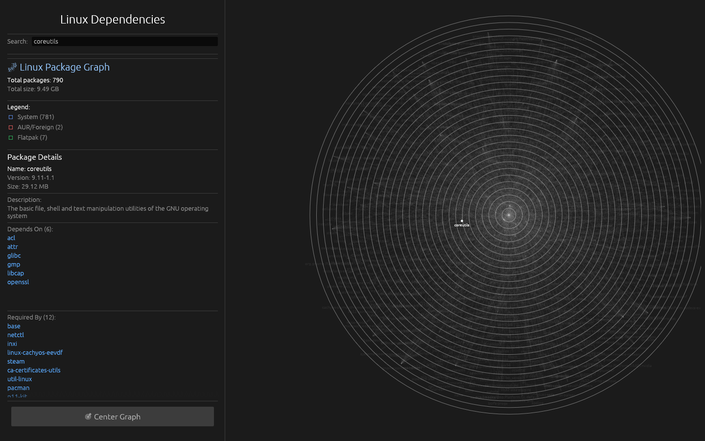
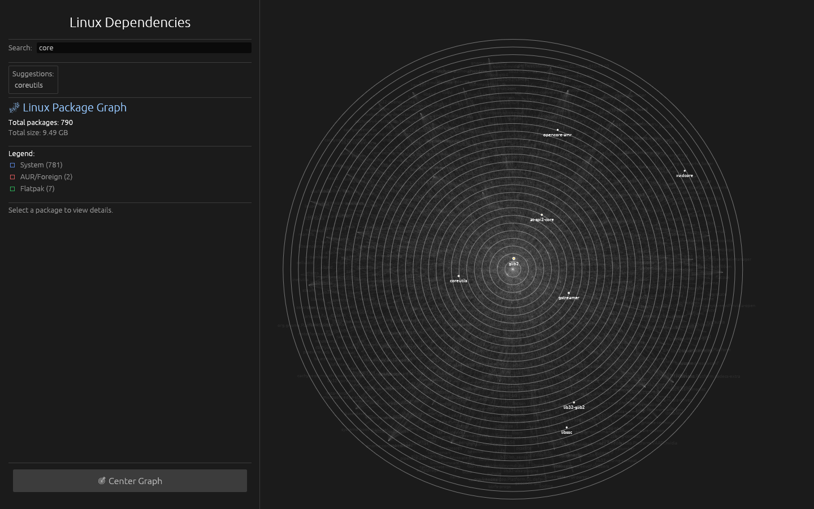

<div align="center">
  <picture>
    <source media="(prefers-color-scheme: dark)" srcset="assets/logo-dark.svg">
    <source media="(prefers-color-scheme: light)" srcset="assets/logo-light.svg">
    
  </picture>

  <h1>Linux Graph</h1>

  <p>
    <strong>Interactive package dependency visualizer for Linux systems.</strong>
  </p>

  <p>
    
    
  </p>
</div>

<br>

Linux Graph reads package metadata from the system package manager, includes Flatpak packages when available, and builds a dependency graph with search, suggestions, and package details.

## Features

- interactive dependency graph
- package search by name and description
- `Depends On` and `Required By` details
- package source highlighting for system, foreign, and Flatpak packages
- automatic filtering of invalid dependency tokens
- idle rendering instead of constant redraws

## Screenshots

<p align="center">
  
  
  
</p>

## Supported Distributions

Linux Graph supports these families:

- Debian and Debian-based distributions
- Arch and Arch-based distributions
- Fedora and Fedora-based distributions
- openSUSE
- Alpine Linux
- NixOS

Tested on real hardware:

- Arch Linux

Tested in Distrobox:
- Debian
- Fedora
- Alpine Linux

Not yet tested:

- NixOS
- openSUSE

The app also works inside Distrobox containers on Podman-compatible setups, as long as the relevant package manager is available inside the container.

## Run

```bash
cargo run --release
```

## Build

```bash
cargo build --release
```

## Test

```bash
cargo test
```

## Requirements

- Rust 1.85+ or newer
- access to a supported package manager
- `flatpak` if you want Flatpak packages included

## Notes

- On systems without a supported package manager, the app cannot build a graph.
- If `flatpak` is not installed, the graph includes only system packages.
- NixOS and openSUSE are supported in code, but they have not been validated in the test set yet.
